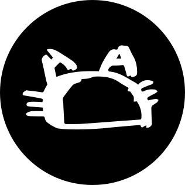

  
  <h4 align="center">
    构建下一代区块链学习平台
  </h4>
  
致力于探索最佳的学习路径和模式、最高效的学习工具、最美好的学习体验，推动人人参与构建的区块链学习社区

   
  

    
    
  

## 👋WELCOME欢迎加入Ed3Academy

Ed3Academy是一个构建下一代区块链的学习平台。

我们的愿景是：**致力于探索最佳的学习路径和模式、最高效的学习工具、最美好的学习体验，推动人人参与构建的区块链学习社区**。

在Ed3Academy中，您可以了解Web3开发者路线图，然后按照开发者路线图选择您想要深入的课程进行实践。

同时Ed3Academy还提供一些百宝箱，其中的工具是我们精心筛选出来的最佳实践，用于解决您在开发学习过程中选择框架、工具的烦恼。

## 📚全部课程

### 😄引言：开发者路线图

这是初学者进行区块链应用开发，Ed3Academy建议您按如下顺序进行学习：

[✂️区块链基础](https://ed3academy.xyz/course/roadmap/section/blockchain)

[📎以太坊基础](https://ed3academy.xyz/course/roadmap/section/ethereum)

[📏Web3.0](https://ed3academy.xyz/course/roadmap/section/web3.0)

[✏️DApp概述](https://ed3academy.xyz/course/roadmap/section/dapp-overview)

[📐智能合约Solidity](https://ed3academy.xyz/course/roadmap/section/solidity)

[📕DApp前端](https://ed3academy.xyz/course/roadmap/section/dapp-frontend)

[📗联盟链](https://ed3academy.xyz/course/roadmap/section/alliance-chain)

[📘NFT](https://ed3academy.xyz/course/roadmap/section/NFT)

[📙DeFi](https://ed3academy.xyz/course/roadmap/section/DeFi)

[📒DAO](https://ed3academy.xyz/course/roadmap/section/DeFi)

### 🏀第一课：创建第一个DApp

在[这门课程](https://ed3academy.xyz/course/Your_First_Token_DApp/section/Section_1_Lesson_1_Get_Started)中，您将打造一个 **您自己的第一个代币** 网站！您将编写 + 部署智能合约，您还将构建网站，让人们连接他们的钱包并与您的智能合约进行交互！听起来是不是让人很兴奋呢？

## 📁百宝箱

### 😄介绍

百宝箱中的所有工具都是我们为您精心挑选的，您在开发学习过程中，可以不用再去搜索选型！您可以在[这里](https://ed3academy.xyz/navigator)探索关于Web3生态组成！

### 🎉功能分类

✂智能合约  

📎合约开发框架  

📏DApp前端开发  

✏️DApp开发配套  

📐基础设施  

📕测试网充值  

📗DApp应用浏览  

📘学习社区  

📙新闻资讯  

📓推荐书籍  

📒求职招聘  

## 👪社区共建

Ed3Academy是社区共建的项目，我们非常期待您能参与社区共建！您可以通过以下方式参与：

### 🤝Github Discussions

GitHub Discussions 是一个围绕开源或内部项目为社区提供协作沟通的论坛。社区成员可以提出和回答问题、分享更新、进行开放式对话，并关注影响社区工作方式的决策。

您可以在[这里](https://github.com/orgs/Ed3Academy/discussions)提出您宝贵的建议、和其他社区成员讨论！非常期待您的真知灼见！

### 🔥Github Pull Requests

您可以获取Ed3Academy的代码，提交对项目的改动！您可以对课程进行错误更正，甚至您可以自建一门课，这最终将展示在Ed3Academy首页中！

## ✨贡献者

  <h4 align="center">
    感谢以下成员对Ed3Academy的贡献
  </h4>
  

