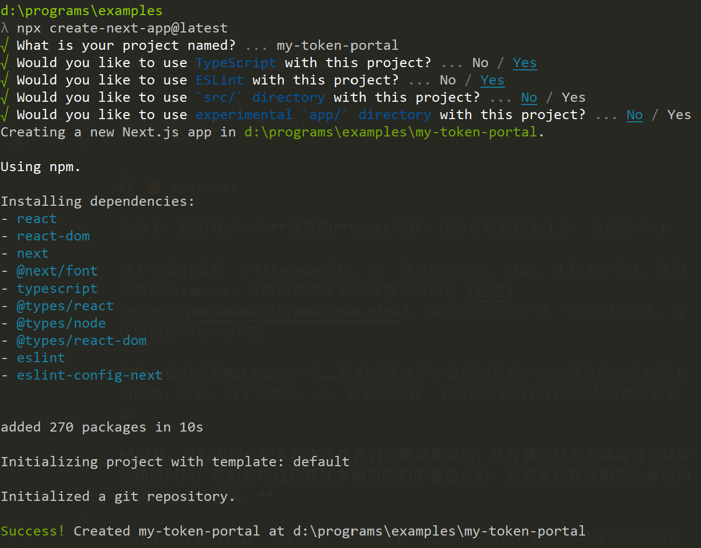

# 设置基础的Next项目

## 💻 设置客户端

现在是时候开始在我们的网站上工作了! 我们的合约非常简单，但还是让我们尽快了解我们的前端如何与合约进行交互吧！

所以，可以有100种不同的方法来设置并部署一个基础的react项目。我将在这里向你展示如何在10分钟内完成这个工作，事成之后你将拥有一个完全部署的react应用并拥有自己的域名等其他一切功能。

## 🤯 Next.js

我们将使用 [Next.js](https://www.nextjs.cn/)! 它是一个基于React的开发框架，可以让我们轻松地构建网络应用。并且您可以在Vercel上直接导入、部署您的Next项目。

你可以直接使用我们为你准备的[基础项目](https://github.com/MetaAlchemy/my-token-portal)直接开始后面的课程，这是最方便快捷的。

你也可以和我一起搭建。

我们使用 create-next-app 创建新的 Next.js 应用程序，它会自动为你设置所有内容。

```bash
npx create-next-app@latest
```

您可以使用像我一样的配置：



设置好后，我们删除一些对我们不必要的文件 例如 `api` 文件夹以及`_document.tsx` 。

接下来，我们将 `index.tsx` 中的内容替换一下

```tsx
import Head from "next/head";
import styles from "../styles/Home.module.css";
import { useEffect, useState } from "react";

const Home = () => {
  const [mounted, setMounted] = useState(false);

  useEffect(() => {
    setMounted(true)
  }, [])

  if (!mounted) {
    return null
  }

  return (
    <div className={styles.container}>
      <Head>
        <title>My Token Portal</title>
        <meta
          name="description"
          content="Generated by @rainbow-me/create-rainbowkit"
        />
        <link rel="icon" href="/favicon.ico" />
      </Head>

      <main className={styles.main}>
        <h2>My Token</h2>
        <div className={styles.card}>
          <div>Balance</div>
        </div>
        <div className={styles.card}>
          <div>Total Supply</div>
        </div>
        <div className={styles.card}>
          <div>Mint</div>
          <div>
          </div>
        </div>
      </main>
    </div>
  );
};

export default Home;
```

为了让页面好看一些，我们先更新一下 `styles/globals.css`

```css
html,
body {
  padding: 0;
  margin: 0;
  font-family: -apple-system, BlinkMacSystemFont, Segoe UI, Roboto, Oxygen,
    Ubuntu, Cantarell, Fira Sans, Droid Sans, Helvetica Neue, sans-serif;
}

a {
  color: inherit;
  text-decoration: none;
}

* {
  box-sizing: border-box;
}
```

再更新一下 `styles/Home.module.css`
```css
.container {
  padding: 0 2rem;
}

.main {
  min-height: 100vh;
  padding: 4rem 0;
  flex: 1;
  display: flex;
  flex-direction: column;
  justify-content: center;
  align-items: center;
}

.footer {
  display: flex;
  flex: 1;
  padding: 2rem 0;
  border-top: 1px solid #eaeaea;
  justify-content: center;
  align-items: center;
}

.footer a {
  display: flex;
  justify-content: center;
  align-items: center;
  flex-grow: 1;
}

.title a {
  color: #0d76fc;
  text-decoration: none;
}

.title a:hover,
.title a:focus,
.title a:active {
  text-decoration: underline;
}

.title {
  margin: 3rem 0;
  line-height: 1;
  font-size: 2.5rem;
}

.title,
.description {
  text-align: center;
}

.description {
  margin: 0 0 2rem;
  line-height: 1.5;
  font-size: 1.5rem;
}

.grid {
  display: flex;
  align-items: center;
  justify-content: center;
  flex-wrap: wrap;
  max-width: 800px;
}

.card {
  margin: 1rem;
  padding: 1.5rem;
  text-align: left;
  color: inherit;
  text-decoration: none;
  border: 1px solid #eaeaea;
  border-radius: 10px;
  transition: color 0.15s ease, border-color 0.15s ease;
  width: 400px;
  font-weight: bold;
}
```

<!-- 🚨 在你点击 "下一课 "之前 -->