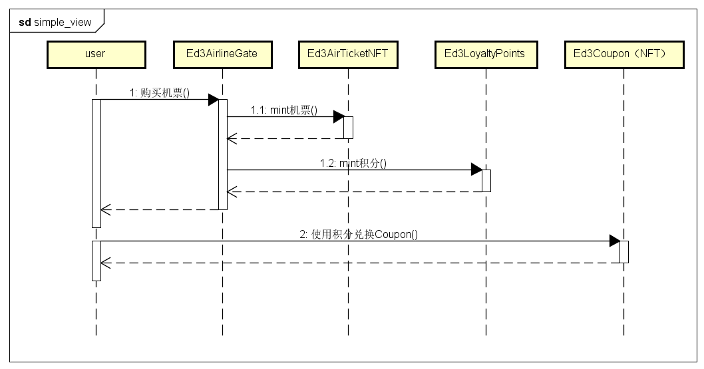

# 🎫Ed3Airticket🎫

用户 User 通过 Ed3AirlineGate 服务窗口购买机票 Ed3AirTicketNFT。我们需要先有一个机票合约，我们采用ERC721标准实现。🥰

ERC721是以太坊上用于实现非同质化代币（Non-Fungible Tokens，NFTs）的一个标准。与传统的同质化代币（如以太币）不同，NFTs是一种独特的数字资产，每个资产都具有其自己独特的属性和价值，无法互换。

ERC721标准定义了一组规则和接口，用于实现NFTs的创建、转移和交易。每个ERC721代币合约都可以定义自己的逻辑和属性，包括代币的名称、符号、总量、拥有者等信息。ERC721代币还可以定义自己的元数据（metadata），包括代币的图片、描述、链接等信息。

ERC721代币的主要特点是每个代币都是独一无二的，每个代币都有自己的唯一标识符（Token ID）。所有的代币都存储在智能合约中，每个代币都可以被单独转移或交易。代币的拥有者可以随时将代币转移给其他人，而代币的属性和价值将保持不变。

1. Ed3AirlineGate 服务窗口将机票 Ed3AirTicketNFT 和积分 Ed3LoyaltyPoints 发放给 User；
5. User 使用 Ed3LoyaltyPoints 积分兑换 Ed3Coupon 优惠券；
